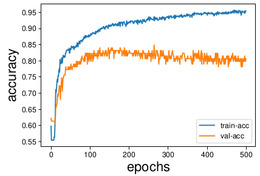

# Human Fall Detection

A brief description of your project goes here.

## Table of Contents

- [Homography](#Homography)
- [MLP](#MLP)
- [RulesBase](#RulesBase)
- [Dataset](#Dataset)
- [License](#license)

## Homography
Check the code is provided in 'Hom.ipynb'.

## MLP

## Dataset

